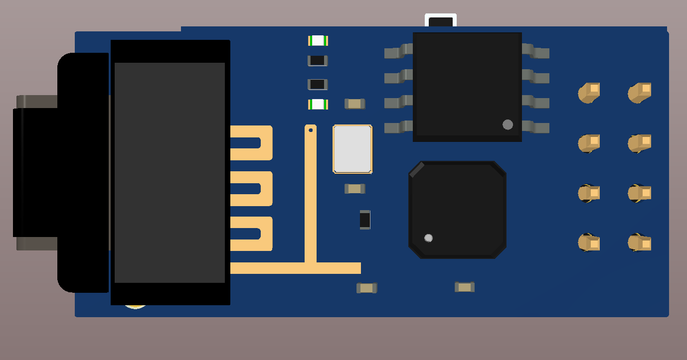

# OLED-ESP
Wireless Hardware Monitor Display with CoAP and mDNS autofinder

# Setting Up
  * flash OLED_128
  * connect to OLED Display and input your network credentials (same as server network)
  * install python 3 or higher and dependencies for HWmon (you can setup as a service/scheduler task) and run
```sh
pythonw hwmon.py
```
